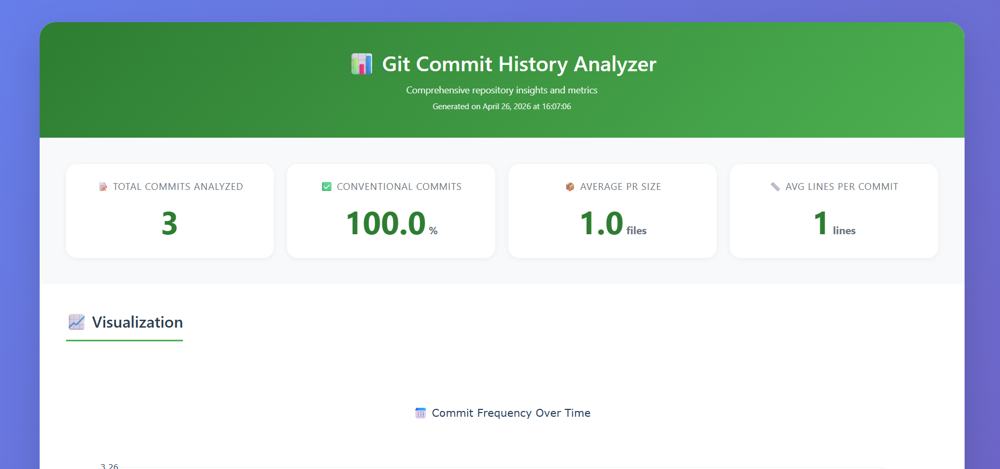

# Git Commit History Analyzer

CLI tool for analyzing git repository commit history with JSON output and HTML reports.

## Features

- ✅ Analyze last N commits (configurable, default 500)
- 📊 Metrics: commits per day/week, top contributors, conventional commit compliance
- 🔥 Code churn hotspots (last 30 days)
- 📄 JSON output mode
- 📈 HTML report with 3+ interactive charts
- 🧪 8+ unit tests with fixture repos
- ⚡ Handles 10,000+ commits without hanging

## Requirements

- Python 3.8 or higher
- Git (installed and available in PATH)

## Installation

### 1. Clone the repository

git clone https://github.com/altynai9128/git-commit-analyzer
cd git-commit-analyzer

### 2. Create and activate virtual environment

Windows:
python -m venv venv
venv\Scripts\activate

Linux/Mac:
python3 -m venv venv
source venv/bin/activate

### 3. Install dependencies

pip install -r requirements.txt

## Usage

Basic syntax

python cli.py <path-to-repository> [--max-commits N] [--output FORMAT] [--report-file FILENAME]

## Parameters

| Parameter | Description | Default |
|-----------|-------------|---------|
| `<path-to-repository>` | Path to local git repository | Required |
| `--max-commits` | Number of commits to analyze | 500 |
| `--output` | Output format: `json` or `html` | json |
| `--report-file` | HTML report filename (for html output) | report.html |

## Examples
- JSON output:
python cli.py /path/to/git/repo --max-commits 500 --output json
- HTML report:
python cli.py /path/to/git/repo --max-commits 1000 --output html --report-file my_report.html
- Default values (analyzes last 500 commits, prints JSON to console):
python cli.py /path/to/git/repo

## JSON Output Example
{
  "total_commits_analyzed": 100,
  "commits_per_day": {
    "2026-04-01": 15,
    "2026-04-02": 22
  },
  "commits_per_week": {
    "2026-W13": 45,
    "2026-W14": 67
  },
  "top_contributors_commits": [
    ["Alice Smith", 45],
    ["Bob Johnson", 32]
  ],
  "top_contributors_lines": [
    ["Alice Smith", 12500],
    ["Bob Johnson", 8900]
  ],
  "conventional_commit_percent": 85.5,
  "avg_pr_size_files": 2.3,
  "avg_pr_size_lines": 145.7,
  "code_churn_hotspots": [
    {
      "file": "src/main.py",
      "change_count": 12,
      "total_lines_changed": 345
    }
  ]
}

## HTML Report
- Creates an interactive HTML file with 4 charts:

- Commit frequency over time (line chart)

- Contributor distribution (pie chart)

- File churn heatmap (bar chart)

- Commits per week (histogram)

## Open HTML report in browser:
- Windows:
start report.html

- Linux:
xdg-open report.html

- Mac:
open report.html

The folder for the report is created automatically. Example: --report-file reports/my_report.html will create the reports folder if it doesn't exist.

## Notes
Works with repositories containing 10,000+ commits (streaming processing)

"Average PR size" is calculated as average changes per commit (for repositories without pull requests)

Code churn hotspots only consider commits from the last 30 days

Conventional commits format: type(scope): description (feat, fix, docs, style, refactor, perf, test, chore)